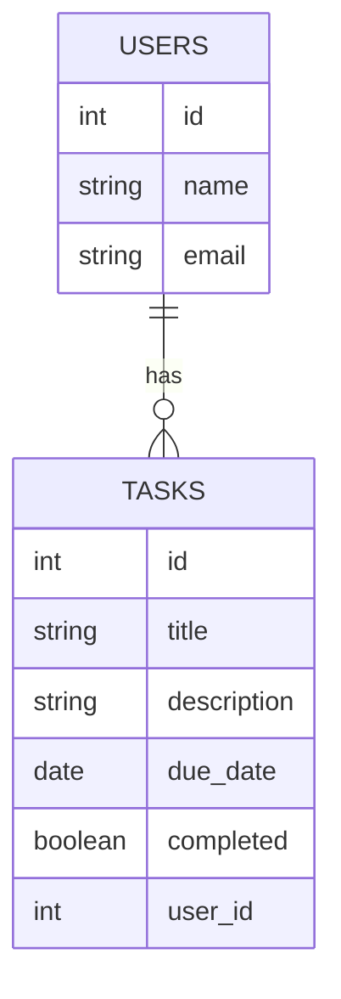

# データモデル設計

```mermaid
erDiagram
    USERS ||--o{ TASKS : has
    USERS {
        int id
        string name
        string email
    }
    TASKS {
        int id
        string title
        string description
        date due_date
        boolean completed
        int user_id
    }
```
